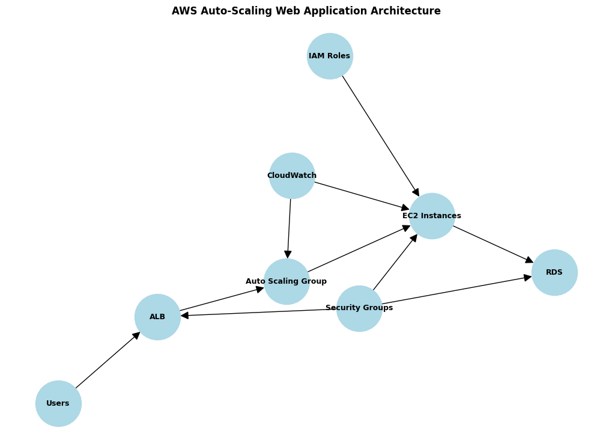

# Auto-Scaling Web Application on AWS

## 🚀 Project Overview
This project demonstrates the deployment of a dynamic web application on AWS with high availability and auto-scaling. It leverages key AWS services like EC2, RDS, ALB, and CloudWatch to ensure the system can handle variable traffic loads efficiently.

---

## 🧱 Architecture

- **EC2 Instances** – Host the web application
- **Application Load Balancer (ALB)** – Distributes traffic evenly
- **Auto Scaling Group (ASG)** – Automatically scales EC2 instances based on load
- **RDS (MySQL/PostgreSQL)** – Provides persistent backend storage
- **IAM Roles & Security Groups** – Control and secure access
- **CloudWatch** – Monitoring, logging, and alarms

---

## 🛠️ Technologies Used

- AWS EC2, RDS, ALB, Auto Scaling
- IAM, Security Groups, CloudWatch
- Linux, Nginx/Apache
- MySQL/PostgreSQL
- Shell Scripting (for EC2 provisioning)

---

## ⚙️ Deployment Steps

### 1. Launch EC2 Instances
- Amazon Linux 2 / Ubuntu
- Install application and web server
- Create a custom AMI for Auto Scaling

### 2. Setup RDS
- Launch a MySQL/PostgreSQL instance
- Configure security group to accept connections from EC2 only

### 3. Configure ALB
- Create a target group
- Set health check path to `/health`
- Register EC2 instances

### 4. Create Auto Scaling Group
- Use custom AMI
- Set desired, min, and max instance counts
- Attach scaling policies (e.g., CPU > 70%)

### 5. IAM & Security
- Assign IAM roles to EC2 with CloudWatch access
- Define security groups:
  - ALB: Accept traffic on port 80/443
  - EC2: Accept traffic from ALB
  - RDS: Accept traffic from EC2

### 6. Monitoring with CloudWatch
- Create CPU-based alarms
- Enable CloudWatch Logs for application logs

---

## ✅ Features

- Fully auto-scalable architecture
- Load-balanced request handling
- Centralized logging and monitoring
- Secure network access using best practices

---

## 📸 Screenshots (Optional)

> Add screenshots here of:
 - Load balancer dashboard
> - EC2 instance scaling events
> - CloudWatch logs/alarms

---

## 📁 Future Enhancements

- Add SSL via ACM & Route 53
- Automate setup using Terraform or CloudFormation
- CI/CD pipeline for automated deployments

---

## 👨‍💻 Author

**Rajnish Singh Thakur**  
[LinkedIn](https://linkedin.com/in/rajnishsinghthakur) • `rajnishsinghthakur107@gmail.com`
